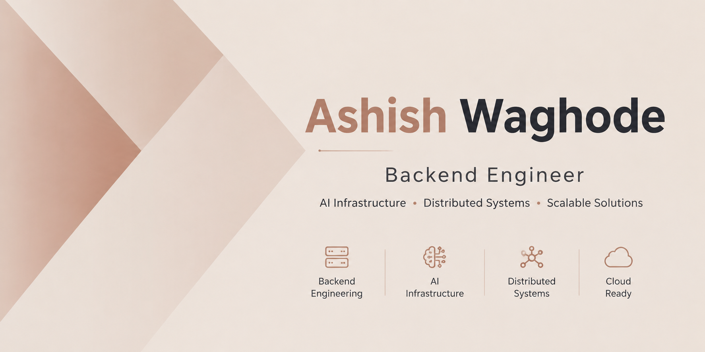

  

<h2 align="center">Backend Engineer | AI Infra & Distributed Systems</h2>

🔭 Computer Engineering undergraduate at University of Mumbai, specializing in <strong>backend engineering</strong> and <strong>AI infrastructure</strong>.

<ul>
<li>🛠️ I build scalable REST APIs, secure auth systems, and cloud-integrated backend architectures with Node.js, Express, and FastAPI.</li>
<li>🤖 I'm equally into the AI side — RAG pipelines, vector search (Qdrant), and reinforcement learning for real-world systems.</li>
<li>📜 Co-hold two Government of India copyright registrations for original software works.</li>
<li>🌐 Check out my <a href="https://portfolio-seven-tau-qsswkw92h3.vercel.app/">portfolio</a> for project write-ups.</li>
<li>💬 Always happy to talk backend architecture, distributed systems, or applied ML — feel free to reach out.</li>
</ul>

<h2 align="center">Languages and Tools</h2>

 

<h2 align="center">📌 Featured Projects</h2>

<table width="100%">
  <tr>
    <td width="50%" valign="top">
      <h3 align="center">OceanLuxe</h3>
      
Full-stack villa booking platform with a 22-endpoint Node.js/Express API, JWT + Google OAuth, Razorpay payments with HMAC-SHA256 verification, and a decoupled FastAPI semantic-search microservice backed by Qdrant.

      
<a href="https://frontend-villabooking.vercel.app/">Live demo</a>

    </td>
    <td width="50%" valign="top">
      <h3 align="center">InvisiMail</h3>
      
Privacy-focused email aliasing platform (Next.js, MongoDB, Mailgun) with webhook-driven inbound processing, a rule-based spam classifier, and a conversational assistant backed by Google Gemini.

      
<a href="https://invisi-mail.vercel.app/">Live demo</a>

    </td>
  </tr>
  <tr>
    <td width="50%" valign="top">
      <h3 align="center">Traffic Optimization</h3>
      
Real-time traffic signal control system: YOLOv8 vehicle detection feeding a Deep Q-Network reinforcement learning agent, served through a 20-endpoint FastAPI backend with live MJPEG streaming.

      
<a href="https://traffic-optimize.onrender.com/">Live demo</a>

    </td>
    <td width="50%" valign="top">
      <h3 align="center">PDF-RAG Chatbot</h3>
      
Retrieval-Augmented Generation system: OCR'd PDF chunks embedded with Sentence Transformers, indexed in Qdrant with per-document filtering, answered via the OpenRouter LLM gateway.

      
<a href="http://139.59.44.180:8501/">Live demo</a>

    </td>
  </tr>
</table>

 

<h2 align="center">📊 GitHub Stats</h2>
<table width="100%">
  <tr>
    <td width="50%">
      

        
      

    </td>
    <td width="50%">
      

        
      

    </td>
  </tr>
</table>

    

<h2 align="center">🤝 Connect With Me</h2>

  

